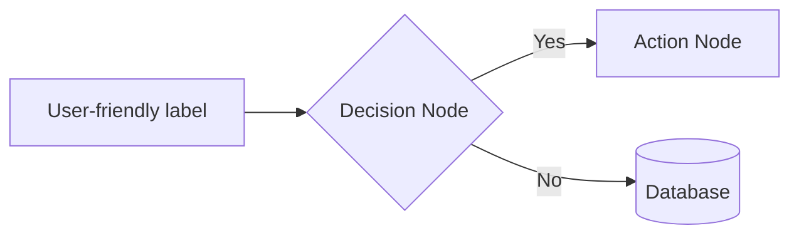
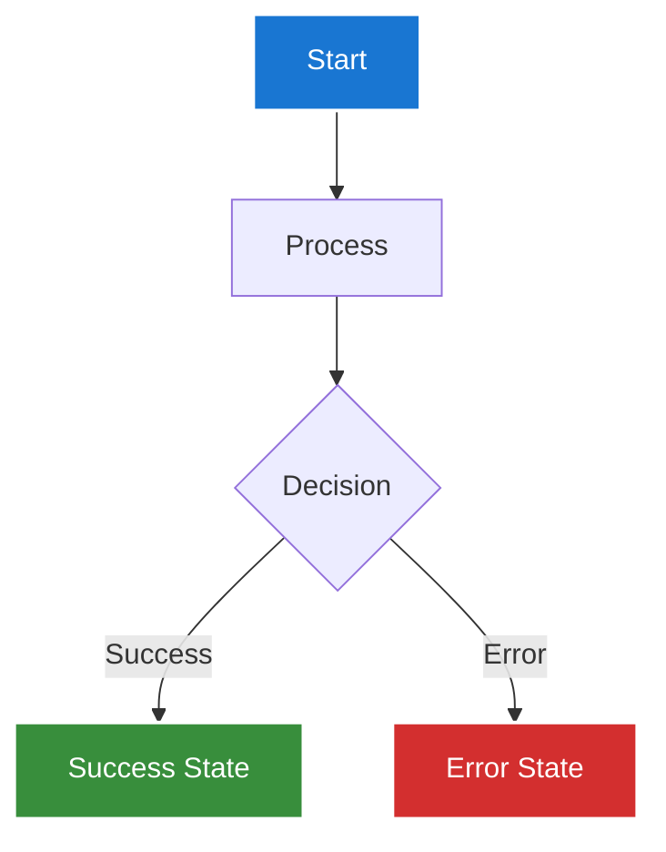
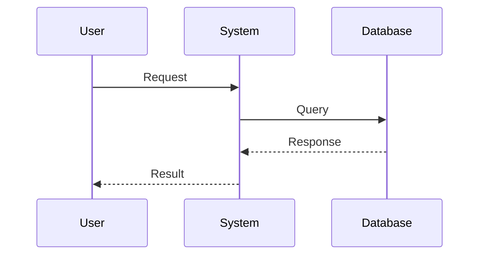
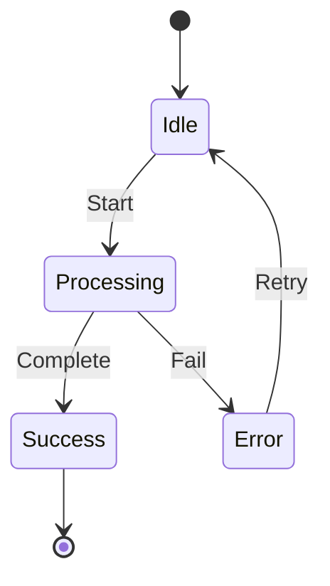
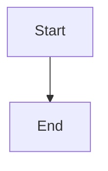
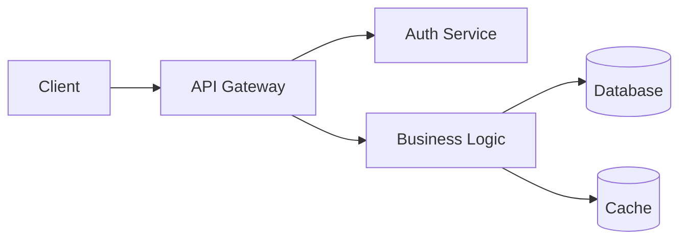
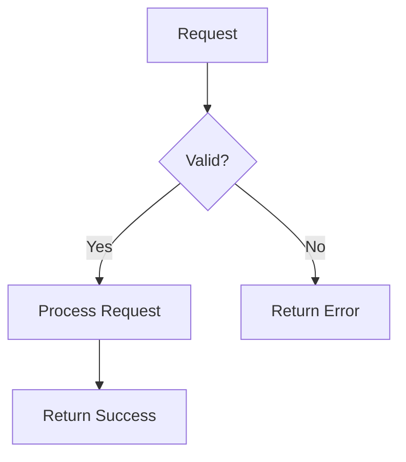
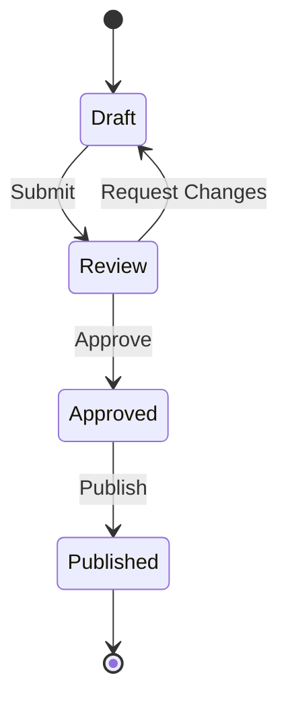

# Claude Diagrams Project Standards

This document defines coding standards and conventions for the claude-diagrams project.

## Project Overview

Claude Diagrams is a Go web application that hosts technical diagrams using Hugo static site generator with the hugo-theme-gallery. All diagrams are SVG files that can be updated through GitHub Actions using Claude. The site features a streamlined interface where all diagrams are displayed on the homepage with previews for quick access.

## SVG Diagram Standards

### File Organization
- All SVG diagrams must be placed in page bundles under `content/diagrams/[category]/[diagram-name]/`
- Categories: `architecture`, `flowcharts`, `network`, `system-design`, `tailnet-topology`, `acl-flows`, `exit-node-architecture`, `subnet-routing`
- Each diagram should be in a page bundle with:
  - `index.md` - Markdown metadata file
  - `[diagram-name].svg` - The SVG diagram file

### SVG Requirements
- Use viewBox for responsive scaling
- Include descriptive titles and text elements
- Use consistent color scheme:
  - Primary: #2196f3 (blue)
  - Success: #4caf50 (green) 
  - Warning: #ff9800 (orange)
  - Error: #f44336 (red)
  - Neutral: #607d8b (blue-grey)
- Include proper labels and legends

### Metadata Format
Each diagram directory should have an `_index.md` or `index.md` with:
```yaml
---
title: "Diagram Title"
description: "Brief description"
date: YYYY-MM-DD
categories: ["Category"]
tags: ["tag1", "tag2"]
---
```

## Mermaid Diagram Standards

### When to Use Mermaid vs SVG
- **Use Mermaid for**: Flowcharts, sequence diagrams, state diagrams, gantt charts, git graphs
- **Use SVG for**: Complex network topologies, detailed architectural diagrams, custom visualizations
- **Hybrid approach**: Create initial diagram in Mermaid, export to SVG for fine-tuning

### Mermaid Syntax Guidelines

#### General Principles
- Keep diagrams simple and focused on one concept
- Use consistent node naming conventions
- Limit diagram complexity (max 20-30 nodes per diagram)
- Use subgraphs to group related components
- Add clear labels to all connections

#### Node Naming Conventions


- Use descriptive labels, not IDs
- Keep labels concise (2-4 words)
- Use proper capitalization
- Avoid technical jargon unless necessary

#### Color Usage in Mermaid
Apply the same color scheme as SVG diagrams with proper contrast:


**Important: Ensure sufficient contrast for readability**
- Use darker shades for fills to ensure white text is readable:
  - Primary blue: Use #1976d2 instead of #2196f3
  - Success green: Use #388e3c instead of #4caf50
  - Warning orange: Use #f57c00 instead of #ff9800
  - Error red: Use #d32f2f instead of #f44336
  - Neutral grey: Use #455a64 instead of #607d8b
- Always use white text (color:#fff) on colored backgrounds
- For light backgrounds (#f5f5f5 or lighter), use black text (color:#000)

#### Flowchart Best Practices
1. **Start/End nodes**: Use rounded rectangles
2. **Process nodes**: Use standard rectangles
3. **Decision nodes**: Use rhombus shapes
4. **Data nodes**: Use parallelograms or cylinders
5. **Flow direction**: Top-to-bottom (TD) or left-to-right (LR)

#### Sequence Diagram Standards


- Use short participant aliases
- Include activation boxes for long-running operations
- Show async operations with dotted lines
- Group related interactions with boxes

#### State Diagram Guidelines


- Always show initial and final states
- Use clear transition labels
- Keep state names short and descriptive
- Show error handling paths

### Mermaid Dark Theme Adaptations
Since our site uses a dark theme:
- Node backgrounds should use darker colors
- Text should be white or light colors
- Borders should be white or light grey
- Avoid pure black backgrounds (use #1a1a1a or #2a2a2a)

### Mermaid Diagram Categories
Place Mermaid diagrams in appropriate categories:
- **flowcharts/**: Process flows, decision trees, workflows
- **architecture/**: System components and interactions (simple ones)
- **network/**: Basic network flows (use SVG for complex topologies)

### File Organization for Mermaid
```
content/diagrams/flowcharts/process-name/
├── index.md        # Contains mermaid code block
└── process.svg     # Optional: exported SVG version
```

### Mermaid Code Block Format
Always use code fences with the `mermaid` language identifier:
````markdown

````

### Common Mermaid Patterns

#### API Flow Pattern


#### Decision Flow Pattern


#### State Machine Pattern


### Mermaid Limitations and Workarounds
- **Complex layouts**: Export to SVG and edit manually
- **Custom shapes**: Use SVG for non-standard shapes
- **Fine positioning**: Limited control, use SVG for precise layouts
- **Typography**: Limited font options, stick to defaults
- **Animations**: Not supported, use static diagrams only

### Tailscale-Specific Metadata Tags

Common tags to use for Tailscale diagrams:
- **Technology**: `wireguard`, `mesh-vpn`, `zero-trust`, `p2p`
- **Components**: `derp`, `exit-node`, `subnet-router`, `acl`, `magicdns`
- **Use Cases**: `remote-access`, `site-to-site`, `internet-egress`, `network-segmentation`
- **Deployment**: `cloud`, `on-premise`, `hybrid`, `kubernetes`, `docker`
- **Security**: `encryption`, `authentication`, `authorization`, `nat-traversal`
- **Architecture**: `distributed`, `mesh-network`, `overlay-network`, `sdp`

## Code Standards

### Go Code
- Follow standard Go formatting (use `gofmt`)
- Use meaningful variable names
- Add comments for exported functions
- Handle errors appropriately
- Keep functions focused and small

### Hugo Configuration
- Don't modify the gallery theme core files
- Use layout overrides in `layouts/` directory
- Keep configuration in `config/_default/`
- Custom layouts:
  - `layouts/index.html` - Homepage with diagram grid
  - `layouts/diagrams/single.html` - Individual diagram view
  - `layouts/diagrams/list.html` - Category listing with previews

## Updating Diagrams via Claude

When requesting diagram updates through GitHub comments:
1. Use `@claude` to trigger the action
2. Be specific about what needs to be changed
3. Include diagram file path if updating existing diagram
4. Specify diagram type for new diagrams

Example:
```
@claude update the microservices architecture diagram to include a new cache layer between the API gateway and services
```

### GitHub Action Setup
- Requires `ANTHROPIC_API_KEY` secret in repository settings
- Workflow file: `.github/workflows/claude-code.yml`
- Triggers on issue comments containing `@claude`

## Development Workflow

1. **Local Development**: Use `./dev.sh` or `go run main.go -dev` for Hugo live reload
2. **Building**: Run `hugo --gc --minify` before building Go binary
3. **Testing**: Ensure all SVG files render correctly in browser
4. **Docker**: Test Docker builds before pushing
5. **Viewing Diagrams**: Homepage shows all diagrams with previews - one click to view full size

## Lint and Build Commands

When working on this project, use these commands to ensure code quality:

1. **Go Formatting**: `go fmt ./...` - Formats all Go code
2. **Hugo Build**: `npm run build` or `hugo --gc --minify` - Builds the static site
3. **Go Build**: `go build -o claude-diagrams .` - Compiles the Go binary
4. **SVG Validation**: `.claude/scripts/validate-svg.sh` - Validates all SVG files

### Automated Hooks

The project includes automated hooks in `.claude/hooks/` that run:
- **Pre-commit**: Runs all lint/build commands before submitting changes
- **Post-tool**: Validates SVG files after modifications
- **Pre-tool**: Prevents modifications to generated files in `public/`

## Commit Standards

- Use clear, descriptive commit messages
- Prefix diagram updates with `diagram:`
- Prefix code changes with appropriate prefix (`feat:`, `fix:`, `docs:`)
- Keep commits focused on single changes

## File Naming

- SVG files: `kebab-case.svg` (e.g., `system-architecture.svg`)
- Markdown files: Use `index.md` for page bundles, `_index.md` for sections
- Go files: Follow Go conventions
- Page bundles: Directory name should match the diagram name in kebab-case

### Tailscale-Specific Naming Conventions

- **Tailnet Diagrams**: `tailnet-[purpose]-topology.svg`
  - Examples: `tailnet-production-topology.svg`, `tailnet-homelab-topology.svg`
  
- **ACL Diagrams**: `acl-[scope]-flow.svg`
  - Examples: `acl-engineering-flow.svg`, `acl-production-flow.svg`
  
- **Exit Node Diagrams**: `exit-node-[region]-architecture.svg`
  - Examples: `exit-node-us-west-architecture.svg`, `exit-node-global-architecture.svg`
  
- **Subnet Router Diagrams**: `subnet-[location]-routing.svg`
  - Examples: `subnet-office-routing.svg`, `subnet-datacenter-routing.svg`
  
- **Connection Flow Diagrams**: `connection-[type]-flow.svg`
  - Examples: `connection-derp-flow.svg`, `connection-nat-traversal-flow.svg`
  
- **Integration Diagrams**: `integration-[service]-architecture.svg`
  - Examples: `integration-kubernetes-architecture.svg`, `integration-aws-architecture.svg`

## Site Navigation

- **Homepage**: Displays all diagrams in a grid with SVG previews
- **Category Pages**: Show diagrams filtered by category with previews
- **Diagram Pages**: Full-size diagram view with metadata and description
- **Direct Access**: All diagrams accessible with one click from homepage

## Tailscale-Specific Diagram Standards

### Brand Colors and Visual Identity

Based on Tailscale's minimalist design approach:
- **Primary Colors**: Black (#000000) and White (#FFFFFF) for high contrast
- **Text Colors**: Black for primary text, grey shades for secondary
- **Background**: Clean white with subtle grey accents (#F5F5F5)
- **Accent Colors**: Minimal use of blue (#2196F3) for interactive elements
- **Node Colors**: Use the project's standard color scheme above, with black borders

### Network Topology Representation

Tailscale uses mesh network topology, which should be visualized as:
- **Mesh Layout**: Nodes interconnected directly, not hub-and-spoke
- **Direct Connections**: Show point-to-point connections between nodes
- **No Central Hub**: Avoid showing a central server for data traffic
- **Dynamic Paths**: Use dashed lines to indicate optional/dynamic routes

### MagicDNS and IP Address Display Conventions

- **IP Format**: Always use 100.x.y.z format for Tailscale IPs
- **Special IPs**: 100.100.100.100 for Quad100 DNS service
- **IPv6**: Use fd7a:115c:a1e0::/48 prefix for IPv6 addresses
- **MagicDNS Names**: Format as `[machine-name].[tailnet-name].ts.net`
- **Short Names**: Can show just machine name when context is clear
- **Display Priority**: Show both IP and MagicDNS name for clarity:
  - Example: `web-server (100.64.1.5)`
  - Or: `monitoring.yak-bebop.ts.net`

### ACL Rules and Policies Visualization

- **Direction**: Use arrows to show directional access (src → dst)
- **Deny by Default**: Show blocked connections with red X or dashed lines
- **Groups/Tags**: Use different shapes/colors:
  - Groups: Rounded rectangles with group: prefix
  - Tags: Hexagons with tag: prefix
  - Users: Circles with user email/name
- **Ports**: Always show port numbers when specific (e.g., :22, :443)
- **Rule Numbers**: Include ACL rule line numbers for debugging

### Node Types Differentiation

Visual representations for different Tailscale node types:

#### Regular Nodes
- **Shape**: Standard rectangle or square
- **Label**: Device name + IP (e.g., `laptop (100.64.1.2)`)
- **Color**: Default node color (white with black border)

#### Exit Nodes
- **Shape**: Rectangle with globe icon or "EXIT" badge
- **Label**: Node name + "Exit Node" + IP
- **Color**: Blue accent (#2196F3) border or highlight
- **Indicator**: Outbound arrow to internet cloud symbol

#### Subnet Routers
- **Shape**: Rectangle with router icon or "SUBNET" badge
- **Label**: Node name + advertised routes (e.g., `192.168.1.0/24`)
- **Color**: Green accent (#4CAF50) border
- **Indicator**: Multiple arrows pointing to subnet blocks

#### Connector Nodes (Kubernetes)
- **Shape**: Rectangle with K8s logo
- **Label**: Connector name + type (subnet/exit/both)
- **Color**: Orange accent (#FF9800) border

### Icon Standards

Based on Tailscale's minimalist approach:
- **Icon Style**: Simple line icons or filled geometric shapes
- **Icon Size**: 16-24px for inline, 32-48px for main components
- **Icon Sources**: Use Simple Icons collection for consistency
- **Component Icons**:
  - Regular nodes: Computer/laptop/server outline
  - Mobile nodes: Phone/tablet outline
  - Exit nodes: Globe or arrow-out icon
  - Subnet routers: Router or network switch icon
  - DERP servers: Cloud or relay icon
  - Connectors: Kubernetes wheel logo

### Typography Standards

Based on Tailscale's website design:
- **Primary Font**: Inter (sans-serif) - optimized for screen readability
- **Fallback Fonts**: System UI fonts (Arial, Helvetica, sans-serif)
- **Font Sizes**:
  - Diagram titles: 18-20px bold
  - Node labels: 14-16px medium
  - Annotations: 12-14px regular
  - IP addresses: 12px monospace (for clarity)
- **Text Colors**:
  - Primary text: Black (#000000)
  - Secondary text: Slate grey (#64748B)
  - IP addresses: Dark grey (#374151)
- **Text Hierarchy**:
  - Use font weight for emphasis (400 regular, 500 medium, 600 bold)
  - Maintain consistent spacing between text elements

### WireGuard Tunnel Representation

- **Connection Lines**: 
  - Solid lines for established direct connections
  - Dashed lines for connections via DERP relay
  - Dotted lines for attempting/negotiating connections
- **Encryption Indicators**:
  - Lock icon or "WG" badge on connection lines
  - Green color (#4CAF50) for encrypted tunnels
- **Tunnel Properties**:
  - Show protocol (UDP) when relevant
  - Include port numbers (default 41641)
  - Label with connection type: "direct" or "relay"

### Coordination Server and Control/Data Plane Visualization

#### Control Plane (Coordination Server)
- **Shape**: Octagon or cloud shape with "Control" label
- **Position**: Top or side of diagram (not in data path)
- **Connections**: Thin dotted lines to all nodes
- **Color**: Light blue (#E3F2FD) background
- **Functions**: Show as annotations:
  - Key exchange
  - Authentication
  - Policy distribution
  - DERP server selection

#### Data Plane (Mesh Network)
- **Connections**: Thick solid lines between nodes
- **Direct P2P**: Show as straight lines
- **Via DERP**: Show with relay node in path
- **No Central Hub**: Avoid hub-and-spoke for data

### DERP Relay and NAT Traversal Visualization

- **DERP Servers**:
  - Shape: Cloud or hexagon with "DERP" label
  - Location labels: City codes (nyc, fra, syd)
  - Color: Light grey (#F5F5F5) background
- **Connection Flow**:
  - Initial: All connections start via DERP (dashed)
  - NAT Traversal: Show DISCO packet exchange
  - Upgrade: Transition from dashed to solid line
- **Fallback Mode**:
  - Persistent dashed line through DERP
  - Label: "relay" with location code

### Shadow and Effects Standards

Following Tailscale's minimalist design philosophy:
- **No Shadows**: Use flat design without drop shadows
- **No Gradients**: Solid colors only, no gradient fills
- **Border Effects**: 
  - 1-2px solid borders for all shapes
  - Black (#000000) for primary elements
  - Grey (#9CA3AF) for secondary elements
- **Hover States** (if interactive):
  - Slight opacity change (90% opacity)
  - No shadow or glow effects
- **Focus Indicators**:
  - 2px offset border in accent color
  - No blur or glow effects
- **Background Patterns**:
  - Solid white background
  - Optional subtle grid (1px #F5F5F5 lines) for alignment

### Node State Representation

Visual indicators for different node states:
- **Online/Connected**:
  - Solid border (2px black)
  - Green dot indicator (8px #4CAF50)
  - Full opacity (100%)
  
- **Offline/Disconnected**:
  - Dashed border (2px grey #9CA3AF)
  - Red dot indicator (8px #F44336)
  - Reduced opacity (60%)
  
- **Connecting/Negotiating**:
  - Dotted border (2px orange #FF9800)
  - Orange dot indicator (8px #FF9800)
  - Pulsing animation (if supported)
  
- **Idle/Inactive**:
  - Solid grey border (1px #E5E7EB)
  - Grey dot indicator (8px #9CA3AF)
  - Normal opacity (100%)
  
- **Authentication State**:
  - Authenticated: Green checkmark overlay
  - Expired: Red X overlay
  - Key expiring soon: Yellow warning triangle

## Tailscale-Specific Diagram Categories

### tailnet-topology
Diagrams showing overall tailnet mesh network structure:
- Device interconnections
- DERP server locations
- Direct vs relayed connections
- Network segments and boundaries

### acl-flows
Access control and permission flow diagrams:
- User/group/tag relationships
- Allow/deny rules visualization
- Port-specific access patterns
- Policy inheritance and precedence

### exit-node-architecture
Exit node configuration and traffic flow:
- Internet egress patterns
- Exit node selection logic
- Traffic routing through exit nodes
- Regional exit node deployments

### subnet-routing
Subnet router and network integration:
- Advertised routes visualization
- Corporate network integration
- Multi-site connectivity
- Route propagation and overlap handling

## Common Tailscale Diagram Templates

### 1. Basic Tailnet Mesh
Standard template showing 3-5 nodes in mesh topology:
- Include mix of device types (laptop, server, mobile)
- Show direct connections between all nodes
- Add coordination server at top/side
- Label with device names and Tailscale IPs

### 2. DERP Failover Scenario
Template demonstrating connection upgrade:
- Two nodes attempting direct connection
- DERP server in between (initial path)
- Show transition from relay to direct
- Include latency/connection type labels

### 3. Exit Node Traffic Flow
Template for internet egress patterns:
- Internal nodes → Exit node → Internet
- Multiple exit nodes in different regions
- Traffic routing decision visualization
- Include external IP indication

### 4. Subnet Router Integration
Template for corporate network access:
- Subnet router bridging tailnet and LAN
- Show advertised routes clearly
- Include both Tailscale and local IPs
- Indicate accessible resources

### 5. ACL Policy Visualization
Template for access control:
- Users, groups, and tagged devices
- Directional arrows for allowed access
- Blocked connections clearly marked
- Port-specific rules highlighted

### 6. Multi-Site Connectivity
Template for distributed networks:
- Multiple office locations
- Subnet routers at each site
- Inter-site mesh connections
- Local resources per site

## Technical Accuracy Checks

### Required Validations
When creating or reviewing Tailscale diagrams, ensure:

1. **Mesh Topology**:
   - ✓ No central hub for data traffic
   - ✓ Direct peer-to-peer connections shown
   - ✓ Coordination server separate from data plane
   
2. **IP Addressing**:
   - ✓ Use 100.x.y.z range for Tailscale IPs
   - ✓ Use fd7a:115c:a1e0::/48 for IPv6
   - ✓ Never show public IPs for internal nodes
   
3. **Connection Types**:
   - ✓ Show initial DERP connection attempt
   - ✓ Indicate direct vs relayed status
   - ✓ WireGuard encryption on all data paths
   
4. **Component Accuracy**:
   - ✓ DERP servers don't decrypt traffic
   - ✓ Exit nodes clearly marked
   - ✓ Subnet routers show advertised routes
   
5. **ACL Representation**:
   - ✓ Default deny behavior shown
   - ✓ Directional access correctly depicted
   - ✓ Tags and groups properly formatted
   
6. **Network Flow**:
   - ✓ Control plane separate from data
   - ✓ No traffic routing through coordination server
   - ✓ Proper NAT traversal representation

### Authentication Flow Visualization

When depicting Tailscale authentication:

1. **Identity Provider Integration**:
   - Show external IdP (Google, GitHub, Okta, etc.) as separate component
   - Use OAuth2/OIDC/SAML protocol indicators
   - Arrow flow: User → Tailscale → IdP → Tailscale → User

2. **Key Elements**:
   - User device initiating auth
   - Coordination server (not handling auth directly)
   - External identity provider
   - Auth token/key distribution back to device

3. **Visual Conventions**:
   - Dashed lines for auth flow (not data)
   - Include protocol labels (OAuth2, SAML)
   - Show redirect URLs clearly
   - Mark MFA/2FA if applicable

### Labeling Conventions for Tailscale Components

1. **Device/Node Labels**:
   - Format: `[device-name] (100.x.y.z)`
   - Include role indicators: [EXIT], [SUBNET], [RELAY]
   - Show OS icons when relevant
   
2. **Tag Labels**:
   - Always prefix with `tag:`
   - Use descriptive names: `tag:prod-web-server`
   - Avoid ambiguous names like `tag:foo-bar`
   
3. **Group Labels**:
   - Prefix with `group:`
   - Use role-based names: `group:engineering`
   - Show member count if relevant
   
4. **Connection Labels**:
   - Type: "direct" or "relay (city)"
   - Protocol: "WireGuard/UDP"
   - Status: "established", "connecting"
   - Latency: "12ms" (optional)
   
5. **Network Labels**:
   - Subnet routes: `192.168.1.0/24 via subnet-router`
   - Exit nodes: `Exit: US-West`
   - DERP locations: `DERP: nyc`
   
6. **ACL Rule Labels**:
   - Format: `Rule #12: group:dev → tag:prod:22`
   - Show action: "allow" or "deny"
   - Include ports when specific

## Line and Arrow Style Standards

### Connection Line Types
- **WireGuard Encrypted Connections**: 
  - Solid lines with 2px stroke width
  - Color: Black (#000000) for primary connections
  - Rounded line joins for smooth corners
- **DERP Relay Connections**:
  - Dashed lines (5px dash, 3px gap)
  - 2px stroke width
  - Color: Grey (#6B7280)
- **Control Plane Connections**:
  - Dotted lines (2px dot, 2px gap)
  - 1px stroke width
  - Color: Light grey (#9CA3AF)
- **Data Plane Connections**:
  - Solid lines with 3px stroke width
  - Color: Black (#000000)
  - Higher z-index than control plane

### Arrow Specifications
- **Arrowheads**:
  - Style: Filled triangular arrowheads
  - Size: 10px length, 8px width
  - Single-headed for unidirectional traffic
  - Double-headed for bidirectional connections
- **Arrow Positioning**:
  - 2px gap between arrowhead and node border
  - Centered on connection line
- **Arrow Colors**:
  - Match the line color
  - Filled with same color as stroke

### Line State Visualization
- **Active Connections**:
  - Full opacity (100%)
  - Optional data flow animation (moving dots at 2s intervals)
- **Inactive Connections**:
  - Reduced opacity (40%)
  - No animation
- **Failed Connections**:
  - Red color (#F44336)
  - X marker at midpoint
- **Connection Health**:
  - Green (#4CAF50): < 50ms latency
  - Yellow (#FFC107): 50-150ms latency
  - Orange (#FF9800): > 150ms latency
  - Red (#F44336): Connection issues

### Line Attributes
- **Protocol Indicators**:
  - SSH: Dashed line pattern (8px dash, 4px gap)
  - HTTPS: Solid line with lock icon at midpoint
  - Custom protocols: Labeled at midpoint
- **Bandwidth Visualization**:
  - Line width proportional to bandwidth (2-6px)
  - Label format: "10 Mbps" at midpoint
- **Line Labels**:
  - Position: Above line at midpoint
  - Background: White (#FFFFFF) with 2px padding
  - Font: 12px Inter regular
  - Text color: Dark grey (#374151)

## Connection Routing Standards

### Line Routing Rules
- **Never Cross Objects**: Lines must route around nodes and other diagram elements
- **90-Degree Turns**: Use orthogonal routing with right angles only
- **Turn Radius**: 5px corner radius for smoother appearance
- **Minimum Spacing**: 10px between parallel lines
- **Grid Alignment**: Snap to 5px grid for consistency

### Routing Patterns
- **Direct Connections**:
  - Use minimal turns (maximum 2 turns)
  - Prefer horizontal/vertical segments
  - Avoid diagonal lines
- **Complex Routing**:
  - Use connection points on node edges
  - Group related connections
  - Consider using connection bundles for multiple lines

### Connection Priorities
1. **Primary Data Paths**: Route first, most direct path
2. **Secondary Connections**: Route around primary paths
3. **Control Plane**: Use outer routing channels
4. **Annotations**: Place to avoid crossing any lines

### Line Bundling
- **Bundle Threshold**: Group 3+ lines going to same destination
- **Bundle Width**: 5px with 2px spacing between lines
- **Bundle Labels**: Single label for entire bundle
- **Bundle Splitting**: Show clear fork points

## Line Animation and States

### Animation Types
- **Data Flow**:
  - Moving dots: 4px diameter, 2s travel time
  - Pulse effect: For active transfers
  - Direction indicators: Animated arrows
- **State Changes**:
  - Fade transitions: 0.3s duration
  - Color morphing: Smooth transitions
  - Connection establishment: Draw animation

### Interactive States
- **Hover Effects**:
  - Highlight full path
  - Show connection details tooltip
  - Increase line width by 1px
- **Selection States**:
  - Bold line (4px width)
  - Contrasting color overlay
  - Related nodes highlighted

### Performance Considerations
- **Static by Default**: Animations optional
- **Reduced Motion**: Respect system preferences
- **CPU Efficiency**: Limit concurrent animations
- **Mobile Optimization**: Simplified animations on touch devices