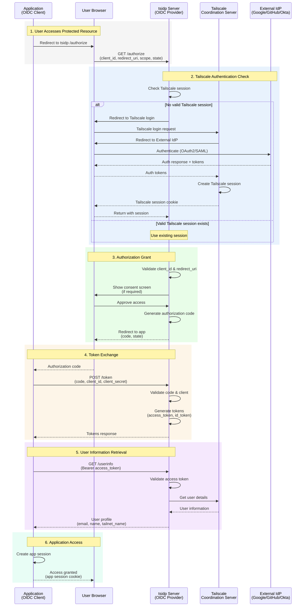

## Overview

tsidp (Tailscale Identity Provider) is an OIDC Identity Provider server that integrates with your Tailscale network. It allows applications that support OpenID Connect to authenticate users using their Tailscale identities, enabling single sign-on (SSO) capabilities within your tailnet.

This diagram shows the complete authentication flow when an application uses tsidp for authentication.

## Key Components

### tsidp Server
- Implements OIDC provider endpoints:
  - `/authorize` - Authorization endpoint
  - `/token` - Token exchange endpoint
  - `/userinfo` - User information endpoint
  - `/.well-known/openid-configuration` - Discovery endpoint
- Runs within your tailnet
- Uses Tailscale authentication for user verification

### Integration Points
1. **Application to tsidp**: Standard OIDC flow
2. **tsidp to Tailscale**: Session validation and user info
3. **Tailscale to External IdP**: Actual user authentication

### Security Features
- No password management in tsidp or Tailscale
- Leverages existing enterprise SSO providers
- Automatic key rotation through Tailscale
- MFA/2FA support through external IdP

## Common Use Cases

tsidp enables authentication for:
- Self-hosted applications (Grafana, Proxmox, Synology)
- Internal tools and services
- Any OIDC-compatible application within your tailnet