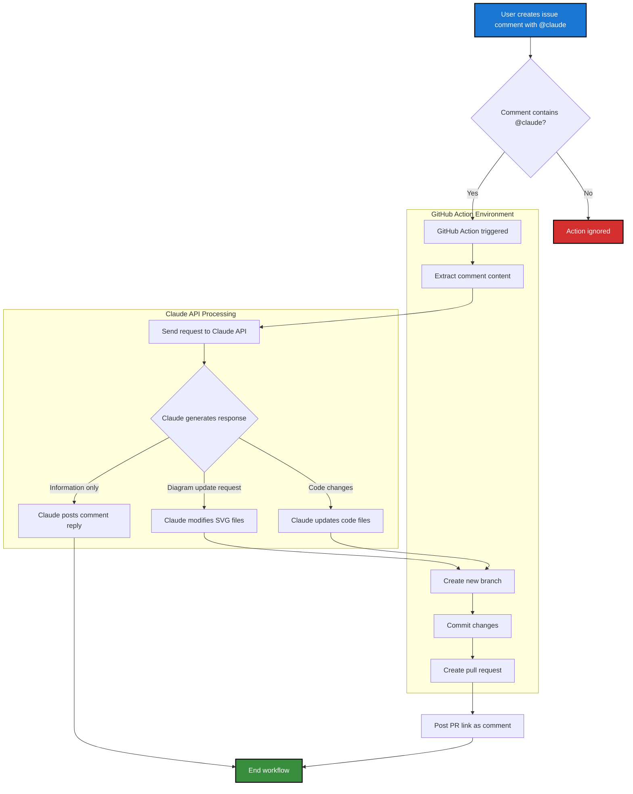

This diagram illustrates how the Claude GitHub Action workflow processes issue comments and updates diagrams in the repository.

## Key Components

1. **Trigger**: User mentions `@claude` in an issue comment
2. **GitHub Action**: Processes the comment and orchestrates the workflow
3. **Claude API**: Analyzes the request and generates appropriate responses
4. **Version Control**: Creates branches and pull requests for changes
5. **Feedback Loop**: Posts PR links or responses back to the issue

## Workflow Steps

1. User creates an issue comment mentioning `@claude`
2. GitHub Action checks if the comment contains the trigger
3. Comment content is extracted and sent to Claude API
4. Claude analyzes the request and determines the action type
5. For file changes, a new branch is created
6. Changes are committed and a pull request is opened
7. The PR link is posted back to the original issue