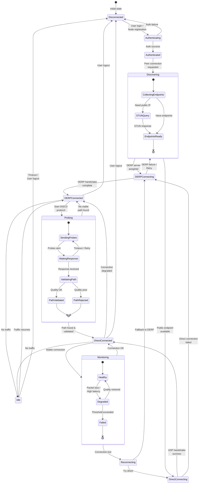

This state diagram illustrates the different states a Tailscale connection can be in and how it transitions between them.

## Connection States Explained

### Primary States
- **Disconnected**: No active connection, node offline or logged out
- **Authenticated**: Node authenticated with control plane
- **DERPConnected**: Active connection through DERP relay
- **DirectConnected**: Direct peer-to-peer UDP connection established

### Transition States
- **Authenticating**: Logging in with identity provider
- **Discovering**: Finding peer endpoints and optimal paths
- **Connecting**: Establishing WireGuard handshake
- **Probing**: Running DISCO protocol to find direct paths
- **Monitoring**: Watching connection quality metrics
- **Reconnecting**: Re-establishing lost connection

### Sub-states
- **CollectingEndpoints**: Gathering all possible peer addresses
- **STUNQuery**: Discovering public IP via STUN
- **SendingProbes**: DISCO protocol active
- **ValidatingPath**: Testing discovered path quality

### State Transitions
- Automatic fallback from direct to DERP on failure
- Continuous optimization attempts while connected
- Graceful degradation based on network conditions
- Quick reconnection using cached endpoints