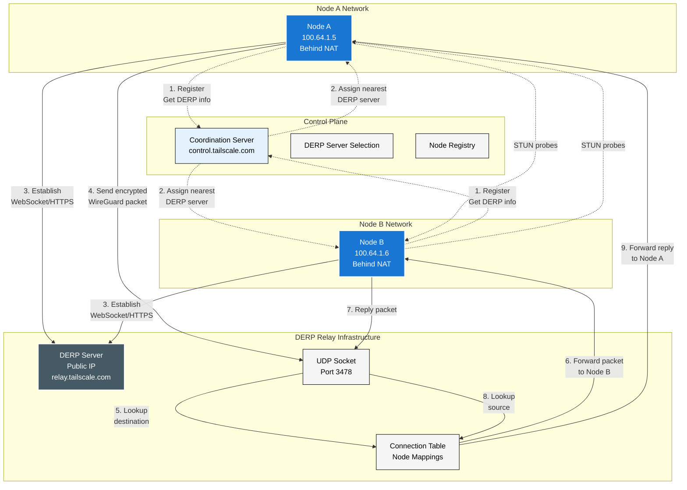

This diagram illustrates how Tailscale's DERP relay system works for UDP packet forwarding when direct peer-to-peer connections cannot be established.

## Key Components

- **DERP Server**: Public relay server that forwards encrypted WireGuard packets between peers
- **Control Plane**: Manages DERP server selection and node registration
- **UDP Relay**: Encapsulates WireGuard UDP packets for transport through restrictive networks
- **Connection Table**: Maps node IDs to active connections for packet routing