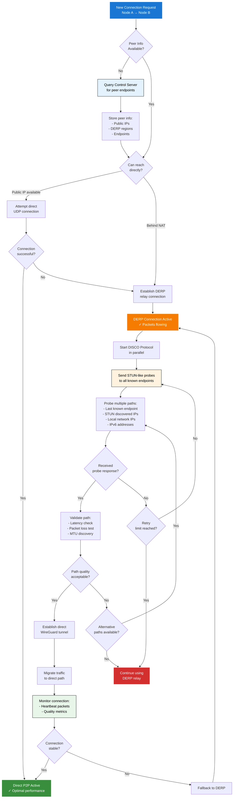

This flowchart illustrates how Tailscale attempts to establish direct connections between peers and upgrades from DERP relay when possible.

## Key Concepts

### DISCO Protocol
- **Purpose**: Discover optimal network paths between peers
- **Method**: Sends encrypted probe packets to multiple potential endpoints
- **Parallel Operation**: Runs alongside active DERP connection

### Connection States
1. **DERP Relay**: Initial connection through relay server
2. **Probing**: Attempting to find direct path while maintaining DERP
3. **Direct P2P**: Optimal state with direct UDP connection
4. **Fallback**: Return to DERP if direct connection fails

### Endpoint Discovery Methods
- **STUN Servers**: Discover public IP and port mappings
- **Local Discovery**: Find peers on same network
- **Cached Endpoints**: Try previously successful endpoints
- **IPv6**: Prefer IPv6 when available for better connectivity