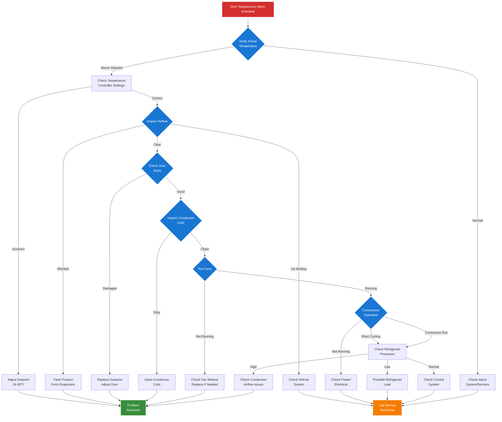

## Supermarket Refrigeration Over-Temperature Alarm Troubleshooting

This flowchart provides a systematic approach to diagnose over-temperature alarms in supermarket refrigeration cases. Follow the decision tree from initial alarm activation through various diagnostic steps to identify and resolve the issue.

### Key Decision Points:
- **Temperature Verification**: Confirm actual vs. setpoint temperature
- **Airflow Inspection**: Check for obstructions or ice buildup
- **Component Testing**: Evaluate fans, compressor, and refrigerant system
- **Resolution Paths**: DIY fixes vs. professional service requirements

### Color Legend:
- 🔴 **Red**: Alarm/Problem state
- 🔵 **Blue**: Decision/Check points
- 🟢 **Green**: Problem resolved
- 🟠 **Orange**: Call service technician

### Critical Temperature Thresholds:
- **Refrigerated Cases**: Should maintain 34-38°F (1-3°C)
- **Freezer Cases**: Should maintain below 0°F (-18°C)
- **Alarm Triggers**: Typically activate when temperature exceeds setpoint by 10°F for more than 90 minutes

### Common Causes:
1. **Airflow Issues** (40% of cases): Product blocking evaporator, dirty coils
2. **Door Seal Problems** (25% of cases): Worn gaskets, misaligned doors
3. **Mechanical Failures** (20% of cases): Fan motors, compressor issues
4. **Refrigerant Problems** (15% of cases): Leaks, improper charge

### When to Call a Technician:
- Refrigerant system issues (requires EPA certification)
- Electrical problems or compressor failure
- Control system malfunctions
- Repeated alarms after basic troubleshooting