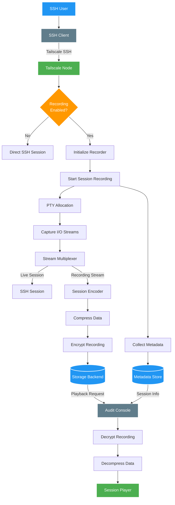

The Tailscale Recorder enables organizations to record SSH sessions for audit and compliance purposes. This diagram illustrates the complete flow from session initiation to playback.

## Overview

Tailscale's session recording feature provides:
- Real-time SSH session recording
- Secure storage of session data
- Playback capabilities for audit review
- Integration with existing compliance workflows

## Key Components

- **SSH Client**: User's terminal or SSH application
- **Tailscale Node**: The target machine with recording enabled
- **Recorder Service**: Handles session capture and streaming
- **Storage Backend**: Secure storage for recorded sessions
- **Audit Console**: Interface for reviewing recorded sessions

## Recording Flow

## Recording Details

### Session Metadata
The recorder captures comprehensive metadata for each session:
- User identity and authentication method
- Source IP and Tailscale node information
- Timestamp and duration
- Commands executed
- File transfers

### Security Features
- End-to-end encryption of recorded data
- Access controls for playback permissions
- Tamper-proof session integrity
- Automatic retention policies

### Storage Options
Organizations can configure storage backends:
- Local filesystem (for testing)
- Cloud object storage (S3, GCS, Azure Blob)
- Compliance-certified storage solutions
- Custom storage integrations

## Compliance Benefits

The Tailscale Recorder helps organizations meet various compliance requirements:
- **SOC 2**: Audit trail for privileged access
- **PCI DSS**: Recording of administrative sessions
- **HIPAA**: Access logging for systems containing PHI
- **ISO 27001**: Evidence of access controls