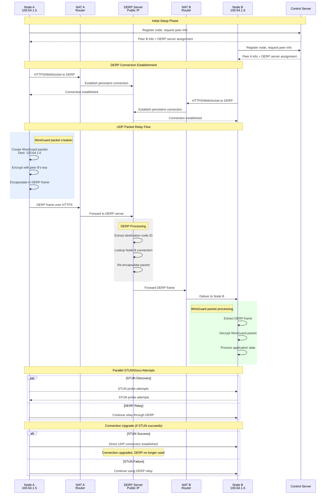

This sequence diagram shows the detailed packet flow when two Tailscale nodes communicate through a DERP relay server.

## Packet Structure

### DERP Frame Format
- **Frame Type**: Control or Data
- **Source Node ID**: Sender's Tailscale node ID
- **Destination Node ID**: Recipient's Tailscale node ID
- **Payload**: Encrypted WireGuard packet

### WireGuard UDP Packet
- **Type**: Data or Handshake
- **Sender Index**: WireGuard peer identifier
- **Packet Counter**: Anti-replay protection
- **Encrypted Payload**: Application data