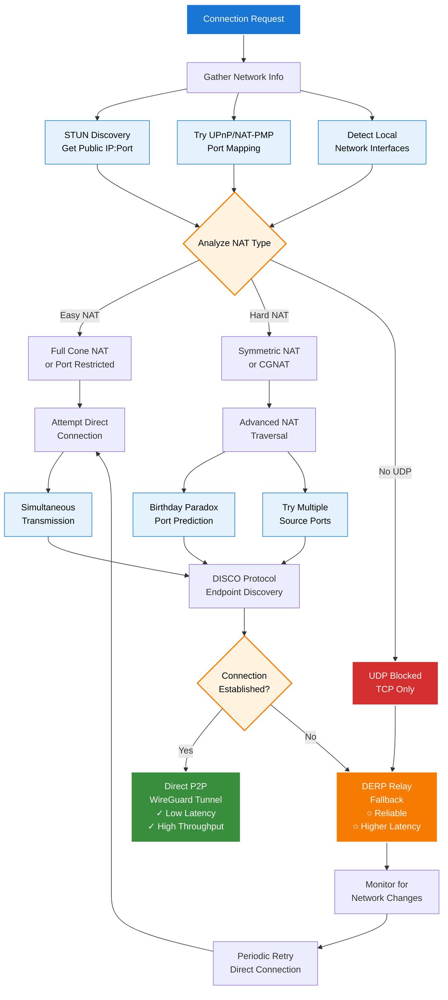

## Overview

This diagram illustrates Tailscale's sophisticated NAT traversal techniques and the decision flow for using direct connections versus DERP relay fallback.

## NAT Traversal Techniques

### Primary Methods

1. **STUN (Session Traversal Utilities for NAT)**
   - Discovers public IP and port mappings
   - Identifies NAT behavior characteristics

2. **Simultaneous Transmission**
   - Both peers send packets at the same time
   - Opens bidirectional firewall holes

3. **Port Mapping Protocols**
   - UPnP (Universal Plug and Play)
   - NAT-PMP (NAT Port Mapping Protocol)
   - Creates persistent port forwards

### Advanced Techniques

1. **Birthday Paradox**
   - Statistical approach for symmetric NATs
   - Tries multiple port combinations

2. **Multi-Path Probing**
   - Tests various source ports
   - Increases connection success probability

### Fallback Strategy

When all NAT traversal techniques fail, Tailscale falls back to DERP relay:
- **Instant Connectivity**: No connection failures from user perspective
- **Continuous Optimization**: Keeps trying direct connection in background
- **Seamless Transition**: Switches to direct when possible without disruption

## Network Scenarios

- **Easy NAT**: Full cone or restricted cone NAT - usually succeeds with basic techniques
- **Hard NAT**: Symmetric NAT or CGNAT - requires advanced techniques
- **No UDP**: Corporate firewalls blocking UDP - must use DERP over HTTPS/TCP