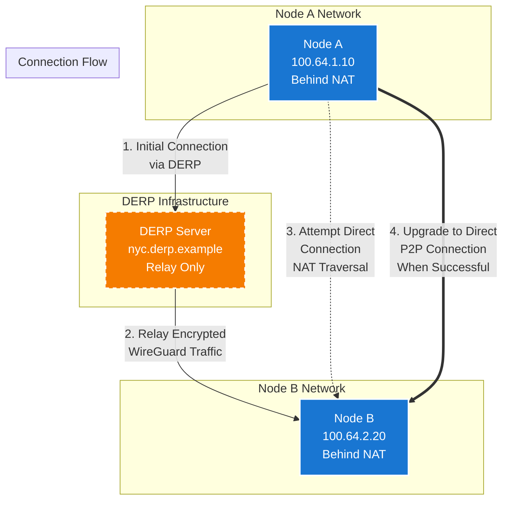

## Overview

This diagram illustrates the basic UDP peer relay flow in Tailscale, showing how DERP (Designated Encrypted Relay Points) servers facilitate connection establishment and serve as fallback relays when direct peer-to-peer connections are not possible.

## Key Points

1. **Initial Connection**: All connections start through DERP for instant connectivity
2. **Encrypted Relay**: DERP servers only relay encrypted WireGuard packets, they cannot decrypt the traffic
3. **Parallel Discovery**: While maintaining DERP connection, nodes attempt direct NAT traversal
4. **Transparent Upgrade**: When direct connection succeeds, traffic seamlessly switches from relay to P2P

## Connection Types

- **Solid Lines**: Active data flow
- **Dashed Lines**: NAT traversal attempts
- **Double Lines**: Upgraded direct P2P connection