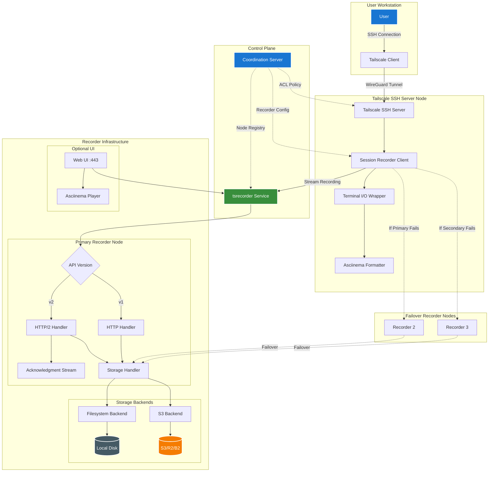
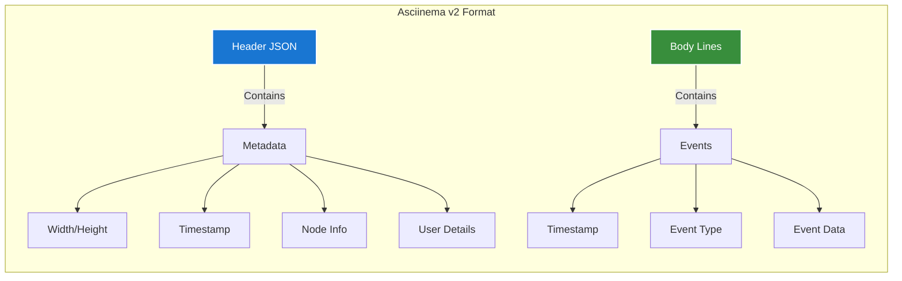
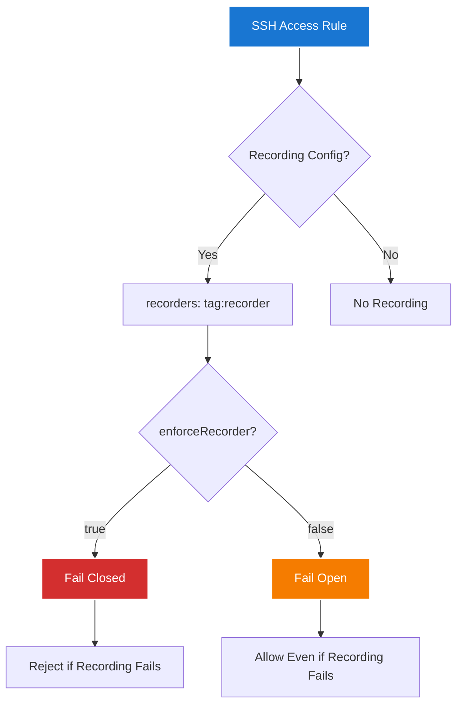
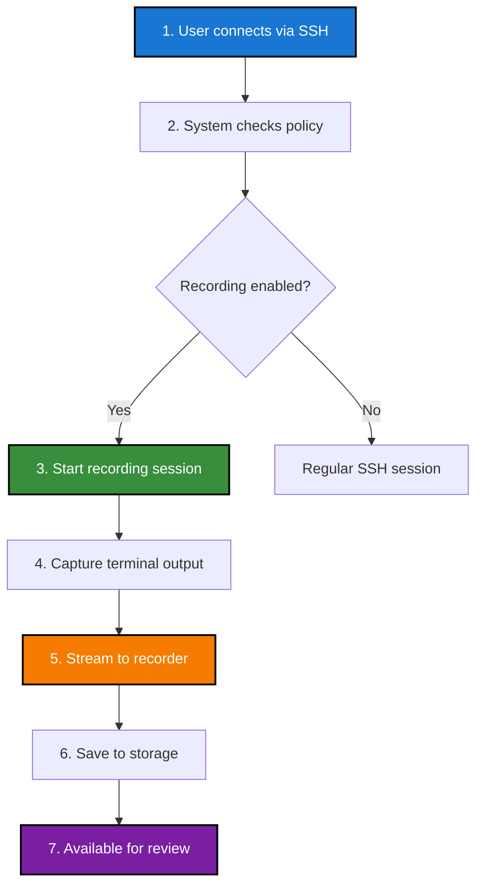

## Overview

This diagram illustrates the architecture and data flow of Tailscale's SSH session recording feature, showing how terminal sessions are captured, streamed, and stored securely within a tailnet.

## Data Flow Sequence

## Recording Format Structure

## ACL Configuration Flow

## Storage Backend Options

## Failure Handling States

## Customer-Facing Overview

```mermaid
graph LR
    subgraph "Your Organization"
        subgraph "Users"
            U1[👤 Developer]
            U2[👤 Admin]
            U3[👤 Support]
        end
        
        subgraph "Your Servers"
            S1[🖥️ Production Server]
            S2[🖥️ Database Server]
            S3[🖥️ Web Server]
        end
        
        subgraph "Your Recording Infrastructure"
            R[📹 Recorder Node]
            ST[(💾 Storage)]
            R --> ST
        end
    end
    
    U1 & U2 & U3 -.->|🔐 Secure SSH| S1 & S2 & S3
    S1 & S2 & S3 -->|📝 Session Recording| R
    
    subgraph "Benefits"
        B1[✅ Compliance]
        B2[🔍 Audit Trail]
        B3[🛡️ Security]
        B4[🎯 Troubleshooting]
    end
    
    ST -.-> B1 & B2 & B3 & B4
    
    style U1 fill:#1976d2,stroke:#000,stroke-width:2px,color:#fff
    style U2 fill:#1976d2,stroke:#000,stroke-width:2px,color:#fff
    style U3 fill:#1976d2,stroke:#000,stroke-width:2px,color:#fff
    style R fill:#388e3c,stroke:#000,stroke-width:2px,color:#fff
    style ST fill:#f57c00,stroke:#000,stroke-width:2px,color:#fff
    style B1 fill:#388e3c,stroke:#fff,stroke-width:2px,color:#fff
    style B2 fill:#388e3c,stroke:#fff,stroke-width:2px,color:#fff
    style B3 fill:#388e3c,stroke:#fff,stroke-width:2px,color:#fff
    style B4 fill:#388e3c,stroke:#fff,stroke-width:2px,color:#fff
```

## How Session Recording Works (Simplified)

## Setting Up Recording (3 Easy Steps)

```mermaid
graph LR
    subgraph "Step 1: Deploy Recorder"
        D1[🐳 Docker Container]
        D2[☸️ Kubernetes]
        D3[🖥️ VM/Server]
        D1 & D2 & D3 --> R1[Recorder Running]
    end
    
    subgraph "Step 2: Configure Storage"
        R1 --> S1[💾 Local Disk]
        R1 --> S2[☁️ AWS S3]
        R1 --> S3[🌐 Other S3]
    end
    
    subgraph "Step 3: Update ACL Policy"
        P[📋 ACL Policy] --> |Define| WHO[Who gets recorded]
        P --> |Define| WHERE[Which servers]
        P --> |Define| HOW[Storage location]
    end
    
    style R1 fill:#388e3c,stroke:#000,stroke-width:2px,color:#fff
    style P fill:#1976d2,stroke:#000,stroke-width:2px,color:#fff
```

## Privacy & Security Guarantees

```mermaid
graph TD
    subgraph "What We See"
        T1[❌ Nothing]
        T2[Your data never leaves your network]
    end
    
    subgraph "What You Control"
        Y1[✅ All recordings]
        Y2[✅ Storage location]
        Y3[✅ Access policies]
        Y4[✅ Retention rules]
    end
    
    subgraph "Security Features"
        S1[🔐 End-to-end encrypted]
        S2[🛡️ Zero-trust access]
        S3[📝 Audit logging]
        S4[🚫 No passwords recorded]
    end
    
    style T1 fill:#d32f2f,stroke:#000,stroke-width:2px,color:#fff
    style Y1 fill:#388e3c,stroke:#000,stroke-width:2px,color:#fff
    style Y2 fill:#388e3c,stroke:#000,stroke-width:2px,color:#fff
    style Y3 fill:#388e3c,stroke:#000,stroke-width:2px,color:#fff
    style Y4 fill:#388e3c,stroke:#000,stroke-width:2px,color:#fff
```

## Common Use Cases

```mermaid
graph TD
    subgraph "Compliance & Audit"
        C1[📊 SOC2/ISO27001]
        C2[🏛️ Regulatory Requirements]
        C3[📋 Internal Policies]
    end
    
    subgraph "Security Operations"
        S1[🔍 Incident Investigation]
        S2[🚨 Threat Detection]
        S3[👀 Activity Monitoring]
    end
    
    subgraph "Operations & Support"
        O1[🐛 Troubleshooting]
        O2[📚 Training & Documentation]
        O3[🤝 Vendor Support]
    end
    
    R[Session Recordings] --> C1 & C2 & C3
    R --> S1 & S2 & S3
    R --> O1 & O2 & O3
    
    style R fill:#388e3c,stroke:#000,stroke-width:2px,color:#fff
    style C1 fill:#1976d2,stroke:#fff,stroke-width:2px,color:#fff
    style S1 fill:#f57c00,stroke:#fff,stroke-width:2px,color:#fff
    style O1 fill:#7b1fa2,stroke:#fff,stroke-width:2px,color:#fff
```

## Key Features

- **End-to-End Encryption**: All recordings streamed over WireGuard-encrypted tailnet connections
- **Privacy by Design**: Recordings stored on user-controlled infrastructure, never visible to Tailscale
- **Flexible Storage**: Support for local filesystem or S3-compatible object storage
- **High Availability**: Multiple recorder nodes with automatic failover
- **Compliance Ready**: Asciinema format allows searching and auditing of sessions
- **Access Control**: Fine-grained ACL policies determine which sessions are recorded
- **Fail-Safe Options**: Configurable behavior when recording infrastructure is unavailable